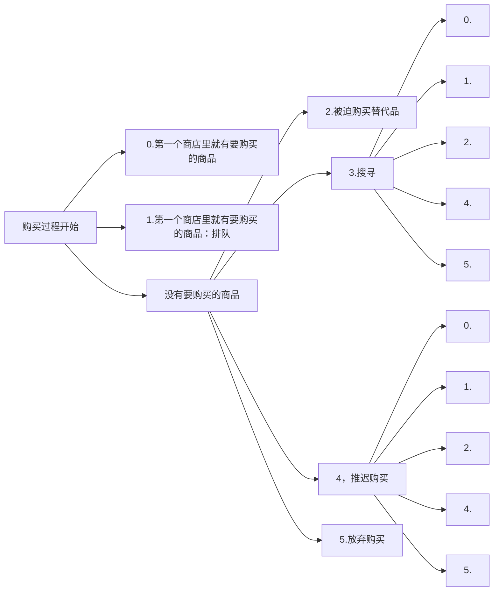

---
---
---
title: 11.1 短缺现象和短缺经济
---

我们可以用一个非常简单的形式来考察个人消费品购买者所面临的选择，例如一位出门购买食品的妇女，假设她具有非常明确的购买目标，其中包括现行价格和商品清单上牛肉的类型。除非运气很差，她的购买过程并不是一个单一的行动，而是一系列的决策（见图11.1）。

情况0是最合意的：购买者走进第一家商店就看见了所需要的商品，然后将它买走。对她而言，购买过程也就结束了。

情况1：有牛肉，但必须排队等候购买。在经典社会主义体制下，顾客常常要排队。就某些商品来说，确实要真的在商店门口或柜台前排起长队。有时候，这只是一个比喻。顾客会得到相应的号码，等轮到他们的时候再到商店里购买。对顾客来说，他们完全有可能买不到这种商品（哪怕是排队也买不到）。在这种情况下，她就要做出其他一系列的选择。

①正规和非正规私人部门在经典社会主义体制下几乎无足轻重，只是在改革阶段才开始发挥更大的作用。因此，关于私人生产与短缺、通货膨胀之间的关系问题将在后面章节中进行分析[19.1，19.5，23.5]。

图11.1 购买过程

情况2：强制性替代（被迫购买替代品）。顾客不得不放弃她最初想购买的商品，然后买一种多少可以替代使用的商品。有时能买到比较近似的替代品，如用另外一种猪肉来替代牛肉；有时只能买到一般的替代品：如冷冻肉或罐头肉，甚至是很差的替代品，如任何一种食品。被迫购买替代品有时会要求顾客必须做出质量上的让步，买一种她当初根本就不想要的东西。或者她愿意花更多的钱购买更好的东西，但这样东西并不是她最初想要的；或者她既花了钱，又买了她当初不想要的东西。

强制性替代对于理解短缺综合症非常重要，它与自愿性替代完全不同。如果顾客首先有两种可供选择的商品，A和B，它们是非常接近的替代品而且供给充足，此时顾客因为自己的偏好或两种商品相对价格的变化，而购买了其中一种商品（例如，用B替代A），那么这就是自愿性替代。但如果因为根本买不到A，才买了B，那就是强制性替代。有人可能会觉得上述条件并不合适，认为如果A 变得比B 更贵，那么顾客就处于一种“经济强制”购买状态。我们没有必要纠缠于这种语义上的争论，关键是要弄清楚区分标准。如果A 和B 同时都能够买到，那么不管A 变得多贵，顾客都是有选择权的（例如，顾客也许会不管花多少钱也要购买A，然后减少在其他方面的开销）。但如果根本就买不到A，那么情况就完全不同了。在这种情况下，短缺会迫使顾客不得不做出另外一种选择。

表11.1说明了强制性替代的情况。当一个典型的匈牙利汽车购买者面对着各种供应充足的东欧国家类似车型的进口轿车（无需排队），他/她会买哪一款呢？从表中的主要对角矩阵可以看出，那些想选择自己喜欢的车型的人依然要排队购买。这些人只是一小部分的购买者，大部分人不得不被迫选择替代车型。①

①Z. Daniel 和A. Semjen（1987）在问卷调查的基础上进行的一项研究表明：在布达佩斯，有超过三分之二的房客在租房过程中都被迫选择了替代品；在既定租金结构下，他们所租到的房子在质量和面积上都不是他们真正想要的住房。

表11.1 匈牙利汽车市场的强制性替代（1977）

| |如果有现货，市场的偏好车型|||||||
|-|-|-|-|-|-|-|-|
|市场订单|Trabant|Warburg|Skoda|Zhiguli|
Moskvich|PolskiFiat126|Dacia|
|Trabant|47|21|1|19|0|5|1|
|Warburg|16|7|7|53|0|1|6|
|Skoda|5|10|0|80|0|0|5|
|Zhiguli|5|30|7|30|1|3|2|
|Moskvich|25|25|0|25|0|0|0|
|PolskiFiat126|25|11|11|39|0|0|0|
|Dacia|0|25|0|50|0|0|0|

资料来源：由Z. Kapitany、J.Kornai 和J.SzaboC. Kruger 根据以下资料为基础整理：

匈牙利市场研究所（1978）、布达佩斯、中央统计局（1980b）和莫克汽车贸易公司（1980）。

注释：接受调查的人数为4120人，有效答案1406份。对角矩阵中没有强制性替代的总量比例，但大部分总量都低于100，因为有些回答问题的人在问卷中选择了“其他”。

让我们再回到那位购买食品的妇女，她也许并不愿意被迫购买替代品。这样，就会出现情况3：到其他商店进行搜寻。如果很幸运的话，她可能在第二个商店找到了一些想要的牛肉，购买过程结束。但也可能她要到第三、第四、第五，甚至到很多商店之后才能买到想要的牛肉，究竟会到多少家商店要取决于她的决心和耐力。

经常发生的情况是，她听说（也许是在第一家店，也许是在后面的店里）自己想买的东西暂时没货，要过一段时间才有。根据这个消息或者以往的经验，她可能决定等一段时间再买。这就是第4种：情况推迟。实际上也就是顾客持币等待将来购买。于是，这种推迟（或者很长时间的搜寻）也就是强制性储蓄。①

最后是第5种情况：放弃购买。

情况0、1、2和5都是以不同的方式结束了购买过程。但正如图11.1所示，在情况3和4时，购买过程可能还没有结束。在继续搜寻的情况下，顾客在第二、第三、第四个商店同样面临着上述选择，如此往复。如果等上一、二个星期之后再出去购买，还是会出现上述各种情况。

情况1—5在这里就被称为短缺现象。尽管具体内容和结果会有所不同，但它们都是因为所要购买的商品出现短缺所造成的，都给顾客带来了烦恼、不方便、牺牲以及其他损失。

上面举出的例子是购买个人消费品或服务时出现的短缺现象，受害者是家庭。供应短缺的商品是一种物质产品——牛肉。同样会出现非物质性质的服务短缺：如幼儿园、学校、大学、文化和医疗设施等等。

短缺现象完全可以进一步推广至生产工具、原材料、半成品以及机械设备等很多产品的购买过程，这时受害者就是企业。情况1：企业加入了投入品供货商的排队行列，那里的订单已经堆积如山。情况2：企业被迫修改原先的技术改造方案，使用质量较差或更贵的投入品，因为无法获得想要的投入品。情况3：企业开始到不同供货商那里搜寻它所需要的投入品，或者从恰好还有存货的同类企业那里借用。情况4：企业推迟购买（或者还有部分存货，或者根本就没有一点存货，但也毫无他法），很可能会因此停止生产。最后是情况5：企业放弃购买投入品，然后改变生产和原材料的管理计划。

①这里需要区分由于短缺造成的强制性储蓄和采用行政手段进行的强制性储蓄，例如，强迫人们购买国库券[8.3]。

在生产部门中，有一类短缺现象特别值得关注：投资项目所需要的机器、设备和建设能力出现短缺，也就是出现了投资紧张[9.2]。

同样，在聘用和招工的过程中，也会出现中间物质产品的短缺[10.2，10.5].①

短缺现象也会发生在对外贸易领域，我们将在第14章关于对外关系的讨论中加以介绍[14.3，14.4]。

下面让我们阐述一下短缺经济这个概念。如果某一经济体制同时满足以下条件，那么就可以将之称为短缺经济：短缺现象（1）非常普遍，几乎出现在所有经济领域（消费者的商品和服务交易，生产工具，包括投资品、劳动力、进出口产品，国际结算）；（2）经常发生，并非特殊情况和零星现象；（3）情况严重，对经济参与者的行为和环境，以及经济活动的特征和结果具有重要影响；（4）持续、长时期存在，而非暂时出现。

可以用“短缺现象”和“短缺经济”做这样一个经济上的描述：经典社会主义体制下的短缺现象是非常普遍、经常发生、相当严重和长期持续的短缺，因此，经典社会主义体制是一种短缺经济。

这一判断主要得到了经验上的支持。表11.2—11.4中的数据以及本章和下一章中的其他很多表格都说明了这一点。此外，这一判断还得到了各方面大量研究文献的实证支持。其实，在社会主义国家生活的人们根本就不需要所谓统计资料的证明。不管是作为消费者还是生产者，在他们的日常生活中充斥着这样的经历，买东西的时候可谓历经“千辛万苦”：排队、被迫使用替代品、搜寻、推迟购买。

短缺现象在资本主义国家里同样会出现，在某些领域中也经常发生、较为严重，而且会持续很长时间（如很多资本主义国家的医疗或教育部门，部分资本主义国家的城市住房）。在特殊情况下，如战争时期，短缺也会变成普遍现象。但如果从一般和基本的状态来判断，资本主义经济不是一种短缺经济。

①下面让我们用一个例子来说明这里的强制性替代和推迟现象。如果某一企业招聘的工人没有及时到达工作岗位，而他/她的工作又非常重要，生产管理者不得不临时让其他人顶替他/她的位置，但替代者的经验和技术很可能都比较差。最后，管理者用别人完成了这项工作。或者，生产管理者也许会改变生产顺序，把目前可以完成的工作提前完成，把前面的工作往后拖延。所有这些行动都会非常仓促，容易造成工作延误并带来损失。

表11.2 等待住房：国际比较

|国家|20世纪80年代申请登记后的平均等候时间（年）|
|-|-|
|保加利亚|5—20|
|捷克斯洛伐克|6—8|
|东德|3-4|
|匈牙利|4-6|
|波兰|15—30|
|苏联|10—15|

资料来源：由G. Such 和I. J. Toth 为本书编辑整理。

注释：保加利亚：在大中城市里，住房申请者被分为六类：（1）住房条件极差的家庭（如住在厨房、地窖和阁楼）；（2）那些和别人同住一套房子的人；（3）转租居住者或住房极为拥挤的家庭（人均居住面积不足5平方米）；（4）住房条件比较拥挤的家庭（人均居住面积5—12平方米）；（5）住房条件拥挤的家庭（人均居住面积12—20平方米）；（6）住房不是很拥挤的家庭（人均居住面积超过20平方米）。实际上，只有1—4类可以获得国家提供的住房。平均等待时间为（1）5—6年；（2）7—8年；（3）9—10年；（4）15—20年。捷克斯洛伐克：1987年大中城市的资料。东德：1982年的全国平均状况。匈牙利：1986年布达佩斯的数据。波兰：1987年购买补贴性合作住房的资料。在以后的年份里，波兰不再修建国有住房。苏联：实际上，国有出租房屋只分配给那些平均人均居住面积不足5—7平方米的家庭或个人。

表11.3 等待（安装）电话：国际比较

|国家|登记安装电话的等待时间（按人数比例）平均等待5年的人数百分比|||
|-|-|-|-|
|国家|1971-1975|1976-1980|1981-1985|
|社会主义国家||||
|捷克斯洛伐克|25.1|30.2|11.3|
|东德|23.3|36.7|—|
|匈牙利|36.6|47.2|55.5|
|波兰|33.6|45.7|57.1|
|资本主义国家||||
|奥地利|14.1|8.5|2.9|
|比利时|0.8|1.2|0.7|
|法国|13.1|7.9|0.9|

资料来源：第一列：国际通讯联盟（1980，第42、52、130、154、260页）；第2—3列：国际通讯联盟（1986，第56、66、150、180、280、288、348页）。

注释：捷克斯洛伐克、匈牙利：以主要路线总需求为基础计算，其中包括新申请者和要求重新安装的人。重新安装是指申请者希望将电话从一个地方转移到另外一个地方。

东德、波兰、奥地利、比利时和法国：以主要路线的登记申请名单为基础计算，其中包括那些由于技术能力短缺（设备，线路等），推迟安装的申请者。

波兰（33.6）：1972—1975年。

资本主义国家：在许多资本主义国家，所有的电话申请都可以立刻得到满足。

表11.4 等待汽车：国际比较

|国家|轿车品牌等待时间（年）||||||
|-|-|-|-|-|-|-|
|国家|Lada|Skoda|Moskvich|Warburg|Trabant|Dacia|
|保加利亚|10-12|5|2|2|1|1|
|捷克斯洛伐克|3-4|—|—|—|—|—|
|东德|17|16|—|14-16|14|15|
|匈牙利|4-6|6|—|1|0|—|
|波兰|5-6|6-8|—|3-4|2-3|—|
|罗马尼亚|—|—|—|—|—|4-6|

资料来源：由2. Kapitany 为本书编辑整理，部分以Z.Kapitany 和L. Kallay（1989）的研究为基础。

注释：所有汽车都是社会主义国家生产，

保加利亚：1988年。

罗马尼亚：只有Dacia车的资料。